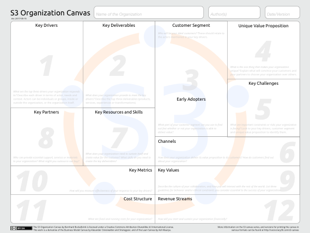
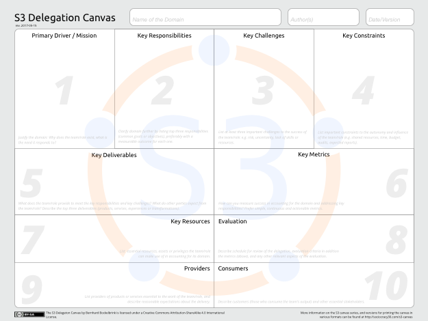
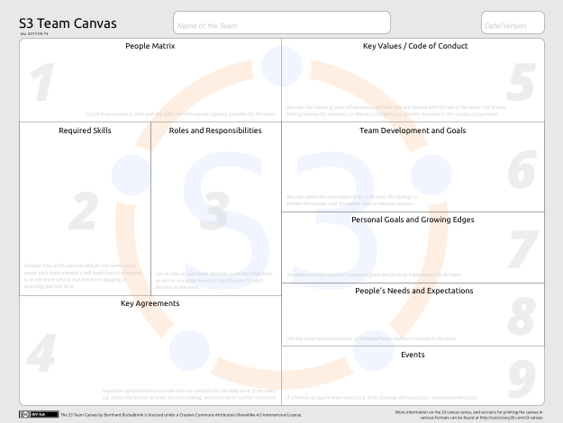

# The S3 Canvas Series

Here's a set of simple and lightweight tools to bring more  clarity and transparency to your organization: the S3 Canvas Series.

As of now there's three different canvases:

The **S3 Organization Canvas**, which describe and understand your organization as a whole and your business model

The **S3 Delegation Canvas** can be used to describe or co-create the domain of a department, team, circle or role in your organization.

The **S3 Team Canvas**, is a companion to the Delegation Canvas and helps a team or circle describe their "inwards" perspective, their development and the relationships of the team's members 

Filling in a canvas in a group typically takes between 30 and 45 minutes, and helps you to develop shared understanding around the organization itself, it’s domains, and your circles or teams.

Each canvas consists of several sections that help you explore different aspects of your organization, domain or team. The sections are numbered to indicate the order of moving through a canvas. 

Currently, each canvas comes as a two-page pdf file: the first page is a guide with a brief explanation for each section, the second page is the actual canvas. 

The S3 Canvas Series has also a [dedicated page on the Sociocracy 3.0 website](http://sociocracy30.org/s3-canvas/).

 The S3 Canvas Series by Bernhard Bockelbrink is licensed under a <a rel="license" href="http://creativecommons.org/licenses/by-sa/4.0/">Creative Commons Attribution-ShareAlike 4.0 International License</a>.
