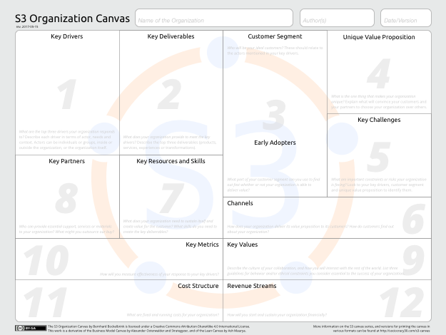
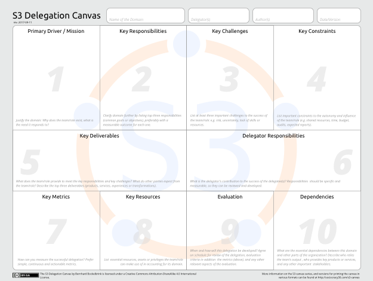

# The S3 Canvas Series

Here's a set of simple and lightweight tools to bring more  clarity and transparency to your organization: the S3 Canvas Series.

As of now there's three different canvases:

The **[S3 Organization Canvas](text/s3-organization-canvas.md)**,  used to describe and understand an organization as a whole and its business model

The **[S3 Delegation Canvas](text/s3-delegation-canvas.md)** can be used to describe or co-create the domain of a department, team, circle or role in an organization.

The **[S3 Team Canvas](text/s3-team-canvas-.md)**, is a companion to the Delegation Canvas and helps a team or circle describe their "inwards" perspective, their development and the relationships of the team's members 

Filling in a canvas in a group typically takes between 30 and 45 minutes, and helps you to develop shared understanding around the organization itself, it’s domains, and your circles or teams.

Each canvas consists of several sections that help you explore different aspects of your organization, domain or team. The sections are numbered to indicate the order of moving through a canvas. 

## Downloads

Canvases are available in several different formats to allow for many different workflows, paper-based and digital, online and offline, individual and collaborative. 

### Traditional Canvas Format 

The traditional canvas format is a boxed layout to be printed (usually in A3 or larger) or to be used in visual planning tools (e.g. [cnvrg](cnvrg.com)).

You can download a two-page pdf file for each canvas, the first page is a guide with a brief explanation for each section, the second page is the actual canvas. 

### Google Drive 

All three canvases are [available in Google Drive](https://drive.google.com/drive/folders/0BxQOKigYtzogVUlnZm1MOFF3VlU?usp=sharing) as Google Docs. 

There's two versions for each canvas:

* the "online" version, wich can be used as a google doc (simply make a copy and fill it in. Delete the instructional texts in each section as you go), or download in various formats (e.g. docx). It works like a charm in a Google-Drive-based logbook, and thanks to good integrations also for logbooks based on Trello, or Evernote for Business
* the "paper" version, which spans several pages and is printable to A4, so you can use it with any printable version, which is in an A4 format, so you can use any old printer you have sitting around

Canvas | Online Template| Print Template
--- | --- | ---
Delegation Canvas | [link](https://drive.google.com/open?id=1pItgTVW-QC3sDDvsBP_uKAKBg407bE294zcYIZJnIgw) | [Link](https://drive.google.com/open?id=1FIu7_UEyxixjEcrNfCiYA6IbO9xOdoOMgra3ucwmd3Q) 
Team Canvas | [link](https://docs.google.com/document/d/1JM5IEfksMx4vFB1Fu1UCCezthMQ8uTNb9md_ZKAvlCQ/edit?usp=sharing) | [link](https://drive.google.com/open?id=1qUlcyjR4TDzCQMnAc9Ugnta_7G_tysixH73yoJrUFMQ)
Organization Canvas | [link](https://drive.google.com/open?id=1m06SEWXXPWfLVgz9FsL5bLyOKlHW6gkHFV2Dc2tBoO0) | [link](https://drive.google.com/open?id=1L5lpu8a1OxPV7fn5xx1veYKrBAzlT-5zKHqKOibT434)

### Plain Text and Other Formats

Use the Markdown versions in this repository and [pandoc](http://pandoc.org) to create additional formats you may need

* [S3 Organization Canvas](text/s3-organization-canvas.md)
* [S3 Delegation Canvas](text/s3-delegation-canvas.md)
* [S3 Team Canvas](text/s3-team-canvas.md)

## Links

The S3 Canvas Series has also a [dedicated page on the Sociocracy 3.0 website](http://sociocracy30.org/s3-canvas/).

## License 

 The S3 Canvas Series by Bernhard Bockelbrink is licensed under a <a rel="license" href="http://creativecommons.org/licenses/by-sa/4.0/">Creative Commons Attribution-ShareAlike 4.0 International License</a>.
